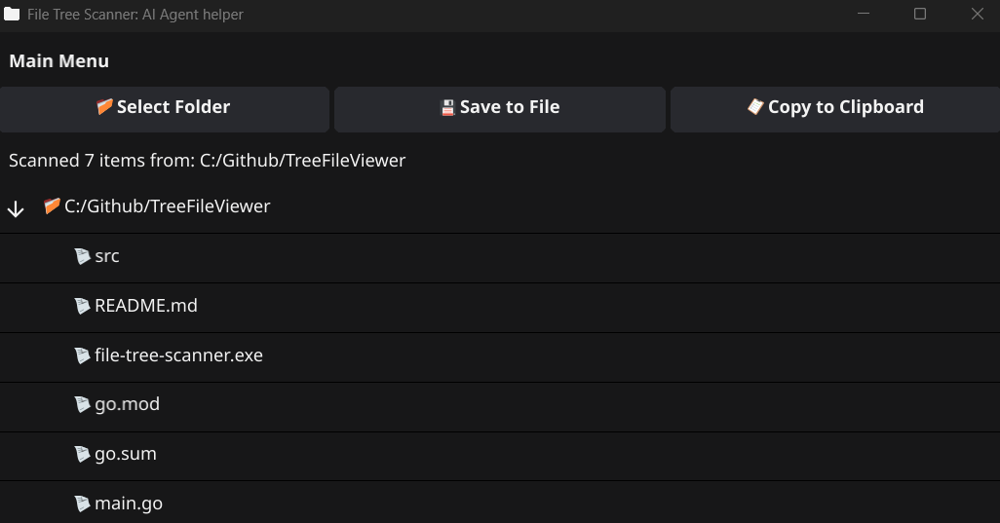

# File Tree Scanner 🌳

> **⚠️ Work In Progress** - This project is under active development.

A cross-platform GUI application for scanning directory structures and generating formatted file trees, designed to provide clear project structure snapshots for AI agents.



## Purpose

This tool creates clean, formatted directory trees specifically for explaining project structures to AI agents like ChatGPT, Claude, and others. When you need to share your project layout with an AI for code reviews, architecture discussions, or development help, this scanner provides the perfect format.

## Example Output

```
File Tree for: C:/Github/MyProject
==================================================

📁 src/
├── 📁 components/
│   ├── 📄 Header.jsx
│   ├── 📄 Footer.jsx
│   └── 📄 Navigation.jsx
├── 📁 utils/
│   ├── 📄 helpers.js
│   └── 📄 constants.js
└── 📄 App.jsx
├── 📄 package.json
├── 📄 README.md
└── 📄 .gitignore
```

## Installation

### Windows (Pre-built Binary)
1. Download `file-tree-scanner.exe` from [Releases](../../releases)
2. Run the executable
3. No additional installation required

### Build from Source (All Platforms)
**Prerequisites:** Go 1.21+ and Fyne dependencies

**Install Fyne Prerequisites:**
```bash
# Linux (Ubuntu/Debian)
sudo apt-get install gcc pkg-config libgl1-mesa-dev libxcursor-dev libxrandr-dev libxinerama-dev libxi-dev

# macOS
xcode-select --install

# Windows
# Install TDM-GCC: https://jmeubank.github.io/tdm-gcc/
# Or install Go with CGO support and ensure gcc is in PATH
```

**Install with `go install`**
```bash
# Ensure $GOPATH/bin is in your PATH
go install github.com/Akaiko1/file-tree-scanner@latest
```


**Or use manual Build:**
```bash
git clone https://github.com/Akaiko1/file-tree-scanner.git
cd file-tree-scanner
go mod tidy
go build -ldflags="-H windowsgui" .
```

## Usage

1. Launch the application
2. Click "📁 Select Folder" to choose a directory
    2a. Or just drag & drop the folder onto the app's active window
3. Copy the generated tree with "📋 Copy to Clipboard"
4. Paste into your AI conversation to explain your project structure

Perfect for sharing project layouts with AI agents for code reviews, architecture discussions, and development assistance.
